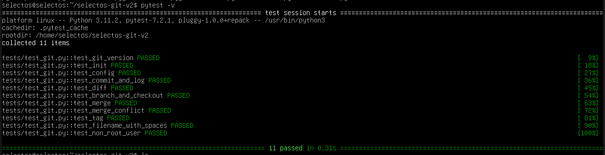

# Тестирование Git на SELECTOS

Проект проверяет совместимость **Git** с **SELECTOS** (на базе Debian).

## Структура

```
├── answers.md  #вопросы заказчику
├── checklist.md    #чеклист
├── tests/
│   └── test_git.py  # автотесты
└── README.md
```

## Инструменты

- Python 3.8+
- pytest

## Что проверяется

| Тест | Что проверяет |
|------|--------------|
| `test_git_version` | версия Git >= 2 |
| `test_init` | `git init` создаёт `.git` |
| `test_config` | `git config` сохраняет значения |
| `test_commit_and_log` | `git add` + `commit` + `log` |
| `test_diff` | `git diff` показывает изменения |
| `test_branch_and_checkout` | создание ветки и переключение |
| `test_merge` | merge без конфликта |
| `test_merge_conflict` | конфликт merge детектируется |
| `test_tag` | создание и удаление тега |
| `test_filename_with_spaces` | файл с пробелами в имени |
| `test_non_root_user` | работа от обычного пользователя |

## Запуск

```bash
# Установить зависимости
sudo apt-get install -y git python3-pytest

# Запустить тесты
pytest -v
```

## Пример использования автотестов


